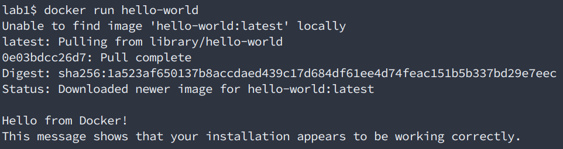
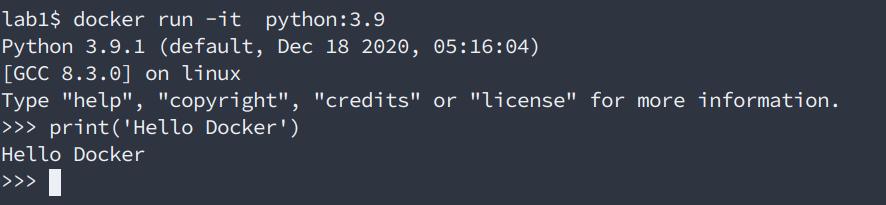
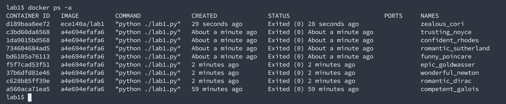

# Lab 1 Intro to Python and Docker

## Expectations

The goal of this lab is to further our understanding of Docker and python, which are the fundamentals for this class and many parts of software engineering. We will ensure Docker is installed, become familiar with Docker basics, and complete a few Python exercises.

If you have not already watched the intro to Docker video and completed one of the python tutorials complete those now and come back when finished.

[Python Intro](https://youtu.be/H055IAuOR-0)

[Docker Intro](https://youtu.be/Mk3ZQ8-iKbM)

**If you are stuck on any parts of this lab, please do not hesitate to ping the instruction team via either email or Slide Space discussion.**

## Part I: Git

1. Be sure to have watched the [git tutorial](https://youtu.be/wV5obkA-yI8)
   - this is to get you an understanding of git, this isn’t the actual part of the lab 
   - Note: If you are familiar with git, you may skip this step (1)
   
2. make sure git is installed
   - Check by typing: “git --version” in terminal or git bash
   - you have git installed if the git version number gets printed out after - if not you must install git from [here](https://git-scm.com/downloads)
   
3. clone the repo into your local computer from GitHub classroom

## Part II: Docker

### Installation

First, let's make sure Docker is installed. If you haven't already, visit [Docker's website](https://docs.docker.com/get-docker/) and install Docker for your platform. If you are currently using Windows 10 Home, ensure you install the [correct version](https://docs.docker.com/docker-for-windows/install-windows-home/).

### Hello (Docker) World

Once installed, let's verify the installation is working correctly. Open up a terminal and enter the following command.

`docker run hello-world`

If everything is working correctly, you should see output similar to the below.



Notice what happened here. We instructed docker to run a container using an image called 'hello-world'. Docker realized we didn't already have the image and automatically downloaded it from the default registry, the [Docker Hub](https://hub.docker.com/search?q=&type=image) and then ran it. How cool!

Take a moment to explore the registry and notice the vast amount of images available to build from! We can also create our own registries to share images with our team, customers, and the community but that is beyond the scope of this lab.

### Python Container

Okay now let's try something a little more ambitious, running an interactive python container. Enter the following into a terminal.

`docker run -it python:3.9`



Notice the extra flag, `-it`. This allows us to run the container in interactive mode (so we can interact with it using our terminal). Also, we specified a specific version of python to use, 3.9. Docker hosts [many different versions](https://hub.docker.com/_/python) of python (and most other images) for use in building applications.

If possible, it is generally recommended to specify the version of the image to ensure nothing breaks down the line. Without a tag docker pulls the latest version available which may cause compatibility issues.

Go ahead and play around in the interpreter and when you are finished you can close the interpreter by typing `exit()`. Or, if you're like me and forget the parenthesis and instead type `exit`, the interpreter will remind you of the proper command.

### Useful Docker Commands

Now let's talk about a few useful Docker commands. A full list can be found [here](https://docs.docker.com/engine/reference/commandline/docker/) but we'll only focus on a few. Alternatively, `docker help` will display much of the same information.

Before we proceed however, let's reaffirm the difference between Docker images and containers. A simple analogy is a blueprint and a house. Using a blueprint, we can build the same house anywhere in the world while maintaining the same structure. The blueprint is the plan and the house is the actual implementation. Inside the house there can be different furniture, appliances and whatnot, but the structure is the same.

A docker image is like a blueprint while the container is an instance of it. Given an image you can create copies of your application anywhere you like. Your computer, your friends computer, somewhere on the cloud, wherever. Similar to the furniture of the house though, the data in each container can be different.

Part of what makes Docker great is platform independence. Before docker, if you wrote an application on some platform and wanted to either collaborate with someone or host it on another machine, you would need to ensure it's compatibility with other machines. Docker however creates it's own little linux virtual machine which all containers share. Furthering the blueprint/house analogy, we can think of this as a way to get around the different building codes in different areas. Docker hides all the building details so when the permit guys come to look at the house, everything looks up to code!

Alright back to our scheduled programming.

### Container Management

To list running containers run

`docker ps` or `docker container ls`

They both give the same information however the latter is considered the more modern approach and is easier to understand what is going on.

Notice however, that this only lists containers that are currently running. In order to view stopped containers as well, the flag `-a` or `--all` must be used.

`docker ps -a` or `docker container ls -a`

You can start or stop a container with the following commands

`docker start <container>`

`docker stop <container>`

And you can remove a container

`docker rm <container>` or `docker container rm <container>`

Where `<container>` is either the Container Id, or Container Name from the `ps` command above.

### Image Management

You can pull an image from the registry using

`docker pull <image-name>`

Optionally you can specify a tag. E.g. to pull python 3.8 use

`docker pull python:3.8`

To remove an image there must be no containers using it so follow the instructions above to remove any that might be using it first. Then use

`docker rmi <image-name>`

### Dockerfiles

So far we've been working with pre-assembled images. But what if we want to create our own? Enter [Dockerfiles](https://docs.docker.com/engine/reference/builder/).

Again, continuing with the blueprint/house analogy, we can think of a Dockerfile as an extension of the current blueprint. We can add more rooms, change the layout etc. In this lab we are going to extend the python image to include our own python script that will run inside the container!

A simple Dockerfile is included in this repository.

```dockerfile
FROM python:3.9

WORKDIR /lab1/code

COPY lab1.py .

CMD [ "python", "./lab1.py" ]
```

Let's analyze the contents of the docker file.

`FROM` - simply means we are going to use the `python:3.9` image as our base.

`WORKDIR` - sets the working directory for any RUN, CMD, and COPY commands.

`COPY` - copies `lab1.py` into the container's working directory.

`CMD` - Runs the `lab1.py` script using python.

Easy right!

Next we need to build the image and then we can run it.

`docker build -t ece140a/lab1 .`

This command simply builds the image using the Dockerfile. The -t flag specifies tag. We can think of this as the image name. The '.' at the end instructs docker to look in the current directory for the Dockerfile.

Finally, we can run the container using

`docker run --rm ece140a/lab1`

Notice the [--rm](https://docs.docker.com/engine/reference/run/#clean-up---rm) flag. Each time you execute a `run` command it will run a new container process based on the image provided. By default a container’s file system persists even after the container exits. But when running a simple foreground process like this, the containers will really start to pile up.



To fix this, we use, the `--rm` flag which will clean up after the container exits so we don't end up with a bunch of stale containers taking up disk space.

NOTE: Only do this with containers that will run short term like the simple python script for this assignment.

### Docker Compose

We've seen that a Dockerfile can allow us to create our own image, and for simple applications this is just fine. But what if we have more complicated applications. For example a webserver which provides a web interface for our users and a database that contains all of the data? We want to be as modular as possible and keep the server and database as separate containers so if we need to make changes to one, we do not need to alter the others. What can we do?

This is where [Docker Compose](https://docs.docker.com/compose/) comes in. We won't get into it here but in essence, docker-compose is a tool for building multi-container applications and defining the interactions between them.

As we progress throughout this course we will certainly be seeing these in action so be aware of their existence but don't worry too much about them now.

## Part III: Dockerized Python Exercises

Okay, now for the fun part. We're going to solidify our understanding of python by completing some exercises. However, we are going to dockerize the script by executing them in a Docker container!

We have already provided a `Dockerfile`, which we will use to build the image, and `lab1.py` which is where you will complete the following exercises.

To build and run the container, follow the steps in the [Dockerfiles Section above](#Dockerfiles).

Be sure to have completed python tutorial mentioned above. Also if you are stuck in any part of these excersises, you may checkout this [supplemental python guide](./supplemental-python-guide.md) we created for you.

### Variable Assignment and Python basics syntax

This should print out "Python 3.x.x" where the x's will be the specific version of Python 3 you have installed. If it shows you are still on Python 2, please install Python 3 before procedding any further.
1. Create a list called "list_1" containing the ints (integers) from 1 to 10.
2. Create a second list "list_2" containing 11-20, but create them **as floats** this time.
3. Update "list_1" so that its first 3 elements get replaced with the list ```["one", "two", "three"]```.
   1. Print list_1 and the output should look like: ```['one', 'two', 'three', 4, 5, 6, 7, 8, 9, 10]```
4. Create a tuple containing the words "eleven", "twelve" and "thirteen" and assign it to the first three elements from list_2.
   1. Print list_2. It should look like: ```['eleven', 'twelve', 'thirteen', 14.0, 15.0, 16.0, 17.0, 18.0, 19.0, 20.0]```
5. Join the two lists into a new list in 2 different ways:
   1. Use the **.extend()** method. Give the name "joint_1" to this list.
   2. Use the "+" operator. Give the name "joint_2" to this list.
   3. Print the joined list. It should look like: ```['one', 'two', 'three', 4, 5, 6, 7, 8, 9, 10, 'eleven', 'twelve', 'thirteen', 14.0, 15.0, 16.0, 17.0, 18.0, 19.0, 20.0]```

### Execution control (loops, logic)

1. Create a list of action commands. It should include "STOP", "LISTEN", "SLEEP", "GO".
2. Create a for loop that loops over each command and prints it to the console.
3. Create a separate list of strings that has the following in order: "CONNECTION FAILURE", "BANANAS", "CONNECTION SUCCESS", "APPLES"
4. Assign the value "SUCCESS" to a variable called **text**.
5. Test the following logic statements:
    1. `"SUCCESS" in "SUCCESS"`
    2. `"SUCCESS" in "ijoisafjoijiojSUCCESS"`
    3. `"SUCCESS" == "ijoisafjoijiojSUCCESS"`
    4. `"SUCCESS" == text`
    5. Are these comparing the whole string, or character by character?
6. Make a while loop that loops over the list from step 3. Print each word unless it contains the string from step 4, in which case you should exit the loop and print: "This worked!"

### Try/except clauses (error catching)

1. Create a string containing your first name. Mine is: `name = "ramsin"`
2. Encode the string to a byte array: `byte_name =  name.encode('utf-8')`
3. Append a non-utf-8 character: `byte_name_bad = byte_name + b'\xef'` # \xef is incomplete unicode
4. Attempt to decode `byte_name_bad` back to a string using the `.decode()` method of byte types. What error did you get? Record the name of the error.
5. To get around this error, which could occur if data transmission gets garbled (as with BLE), we will use a try-except clause. Create a try-except clause for decoding byte types. If there is a decoding error,  set the return string to an empty string.
6. Copy this try except clause twice, once for `byte_name` and once for `byte_name_bad`. Print the result for each. `byte_name` should print the same as `name` while `byte_name_bad` should print nothing.

### Functions

We want to make a list of fixed length to which we can continuously add new elements. Create a function to do this task. The function should accept the "fixed length" list as well as the "to append" list as arguments and output the "new list" as output. The function signature should be as follows:

```python
def list_shift(base_list, new_data):
    # shift the contents of base_list with the new data
    return base_list
```

And the output:

```python
>> fixed_length_list = [1,2,3,4]
>> new_data = [5,6,7]
>> list_shift(fixed_length_list, new_data)
[4,5,6,7]
```

**Bonus**: are there any edge cases that the your function doesn't handle? Can you think how you might address them?

### Final Exercise

In the same lab1.py module, create a function called timer() have it print out a countdown from the number of seconds provided by the user input. You can take in user input from the command line by calling the `input()` function and you can use `time()` to measure elapsed time.

You can use the `time` library.

For example:

```bash
Enter a number of seconds:
>> 5

# will print out 5, 4, 3, 2, 1, 0 and then terminate but it will do it in 1 second increments just like a timer.
```

Have fun and get creative!

Also in the lab1.py module, print out your name, PID and GitHub username.

For example: 

```
Bryant Liu
A12345678
gitUserName
```

## Part IV: Submission
Recall from before, the [git tutorial]( https://youtu.be/wV5obkA-yI8)
   - please watch it if you are unclear about any parts of this, if not, you can skip this

Once you have completed all of the exercises above and you can confirm assignment1.py is producing the correct output, then simply submit your changes to Git using the standard sequence of commands:

```bash
git add .
git commit -m '<some meaningful commit message>'
git push origin master
```


#### Deliverables:
- turned in (git commit) the repository
- Docker successfully runs
- Python file (lab1.py) are properly within the docker folder structure 
- clear effort on the excerises (From *Variable Assignment and Python basics syntax* to *Functions*)
- python outputs: 
   - countdown
   - student name, PID, GitHub name
   
***Once again, if you are stuck on any part of this lab, please do not hesitate to contact the instruction team via either email or slide space discussion***

Good Luck!!
